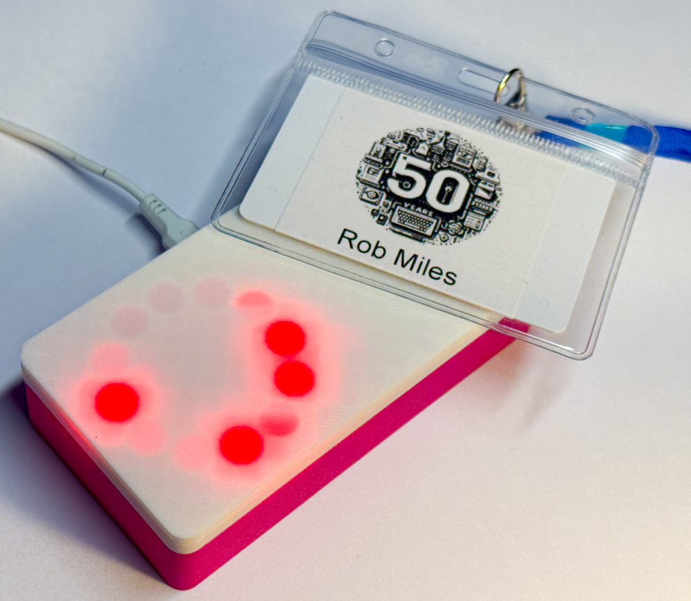
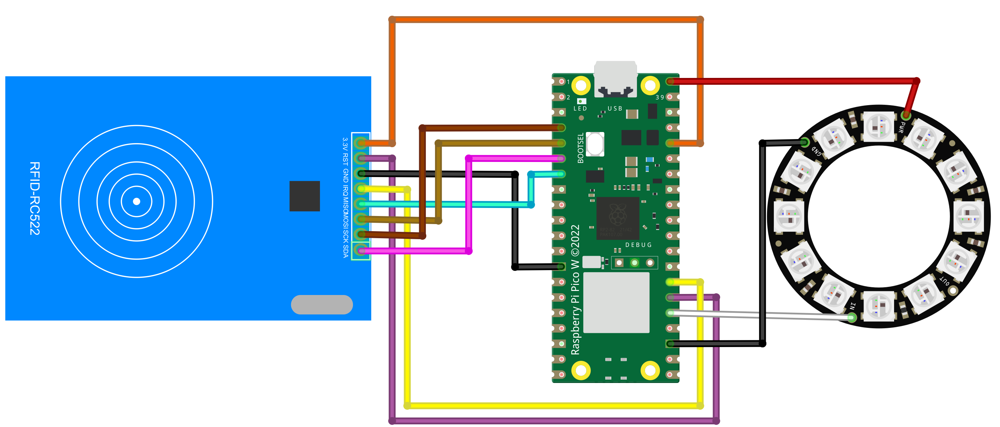
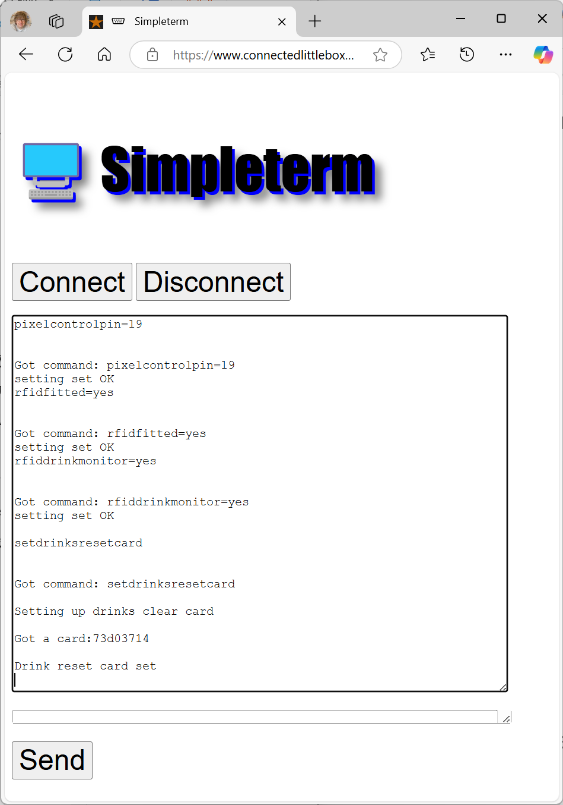
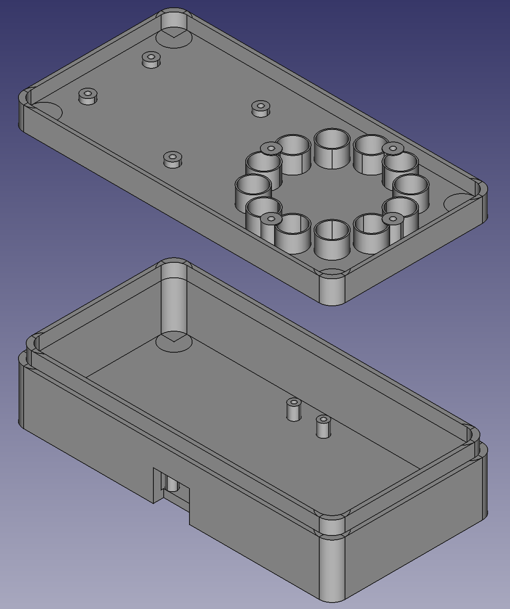

# PICO-RFID-free-drinks-manager

The manager was used to distribute free drinks at the (Hull University Computer Science 50th Anniversary Celebrations)[https://hullcs50.com/]. It tracks drinks using RFID cards. The first time a card is scanned the device displays green lights, telling the bar staff that they can have a drink. If the same card is scanned again the lights turn red. A special “reset” card makes all the cards work again. 
## Hardware Connections

These are the connections for each pin. You can use different pins, but you will need to change the software if you do. 

| RFID            | PICO |
|-----------------|-----------------|
|3.3v	          |Pin 36 3.3v      |
|RST	          |Pin 26 GPIO 20   |
|GND	          |Pin 13 GND       |
|IRQ	          |Pin 27 GPIO 21   |
|MISO	          |Pin 7 GPIO 5     |
|MOSI	          |Pin 5 GPIO 3     |
|SCK	          |Pin 4 GPIO 2     |
|SDA	          |Pin 6 GPIO 4     |

|Pixel Ring	      |PICO             |
|-----------------|-----------------|
|Power	          |Pin 4 VSYS       |
|GND	          |Pin 23 GND       |
|DI	              |Pin 25 GPIO 19   |
## Software Installation
The software folder contains code for ESP8266 and Raspberry Pi PICO devices. For the ESPP8266 you can use the image supplied. For the PICO you hold down the boot button on the device, plug the device into your computer and then drag the firmware.uf2 file onto the storage device which has appeared on your machine. 
## Software Configuration

You configure the box via a serial connection. Plug the box into a computer and use the [terminal](https://www.connectedlittleboxes.com/simpleterm.html) above. Press Connect to connect to the box and then enter the following:

* pixelcontrolpin=19
* rfidfitted=yes
* rfiddrinkmonitor=yes
* setdrinksresetcard

Enter each command in turn and press the Send button. If the leds are not working, unplug the device and plug it back in again to update the pixel control pin setting. When you enter the final command the leds should change to white. Scan the card you are going to use as the reset card and the leds will change to blue. This card can then be used to reset the drinks cards. 
## Case

STL files for the case are in the case folder.
## Led Power Supply issues
The circuit above connects the power for the pixel ring to the VSYS pin on the PICO. This pin is connected to the USB 5V power input. This is the best way of providing power to a pixel, as long as it works. It might not work because some neopixels require a higher signal voltage than the 3.3v provided by a Pico. If this is the case for you, connect the neopixel power input to the 3.3 volt output from the PICO. This will make the pixels slightly dimmer, but they will work. 
## RFID driver issues
The software uses the RFID driver code from [Miguel Balboa](https://github.com/miguelbalboa/rfid). The source code as available on GitHub has an error which prevents it from compiling correctly for the PICO device. The error has been fixed and the library code incorporated directly into the Connected Little Box  project so that you can build it successfully. 
## Connected Little Boxes
This project uses [HullOS-X](https://github.com/connected-little-boxes/HULLOS-X), which is the latest version of the box control software. 

Have fun

[Rob Miles](https://www.robmiles.com)